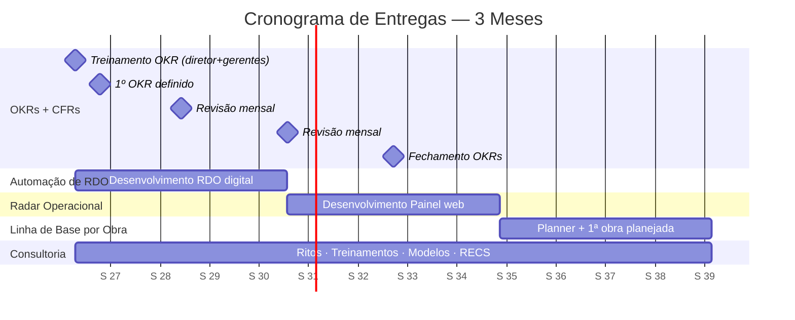

# Proposta de Consultoria — DH Perfuração de Poços

**Período:** 3 meses  
**Dedicação:** 20h semanais  
**Foco:** Operacional

---

## Sumário

1. [Contexto e Diagnóstico](#1-contexto-e-diagnóstico)
2. [Framework de Gestão: OKRs + CFRs](#2-framework-de-gestão-okrs--cfrs)
3. [Produto 1 — Automação de RDO](#31-produto-1--automação-de-rdo-mês-1)
4. [Produto 2 — Radar Operacional](#32-produto-2--radar-operacional-mês-2-3)
5. [Produto 3 — Linha de Base por Obra](#33-produto-3--linha-de-base-por-obra-mês-3)
6. [Cronograma](#6-cronograma)
7. [Investimento](#7-investimento)
8. [O que esta consultoria NÃO é](#8-o-que-esta-consultoria-não-é)
9. [Próximos Passos](#9-próximos-passos)

---

## 1. Contexto e Diagnóstico

### 1.1 A Empresa Hoje

A DH atua em sete frentes: Avaliação Hidrogeológica, Licenciamento e Outorga, Perfuração de Poço Tubular Profundo, Manutenção Preventiva e Corretiva, Recuperação de Poço, Operação de sistema e BOT (Build Operate and Transfer). É um escopo amplo para uma equipe enxuta, e o crescimento recente de 2 para 4 sondas simultâneas evidenciou o limite dos processos atuais.

Hoje a DH opera majoritariamente com contratos avulsos. O objetivo é migrar para contratos de longo prazo com grandes consumidoras. Contratos que garantam fluxo de caixa contínuo, carteira previsível de obras e margem para acelerar ou desacelerar projetos conforme a necessidade, em vez de buscar o próximo contrato para não perder a equipe. Mas para acessar esse mercado, a DH precisa de algo que ainda não tem: previsibilidade. Os gerentes dominam suas áreas, mas quando uma obra depende de várias áreas ao mesmo tempo (materiais que precisam estar no canteiro na data certa, gente disponível com a especialidade certa), a informação se perde. Os mesmos erros se repetem de uma obra para a outra porque a empresa ainda não transforma aprendizados em procedimentos. Não existe um sistema que diga, em tempo real, quanto do cronograma já foi consumido, quantas horas foram produtivas ou se os materiais e a mão de obra vão estar disponíveis na semana que vem. A empresa decide no escuro, e o preço disso aparece na seção seguinte.

### 1.2 O Problema Central

A DH cresceu rápido e a estrutura não acompanhou. Os sintomas são claros:

- **22,5 dias de horas paradas no último projeto** (Parc das Artes: 32 dias previstos → 104 dias reais, 69% de atraso)
- Distribuição das horas paradas por causa raiz:
  - **43% — Aguardando Terceiros** (tubos fornecidos pelo cliente via faturamento direto + decisões da Saerp)
  - **18% — Falta de Equipe** (absenteísmo, DTS entre projetos, dimensionamento insuficiente)
  - **18% — Manutenção Corretiva** (quebras de bomba, fole, underreamer, swivel sem preventiva)
  - **9% — Atividades-Meio / Logística** (deslocamentos, processos administrativos obrigatórios)
  - **9% — Materiais / Insumos internos** (concreto, consumíveis de solda, peças de reposição)
  - **3% — Condições Climáticas** (chuva)
- **R$112k perdidos** em produto químico por água não testada (problema evitável)
- **R$400-500k em risco** de pleito por RDO enviado com atraso
- **14 RDOs atrasados** em uma única semana → geólogos afogados em trabalho administrativo essencial
- **Não se sabe se a mão de obra crítica está disponível** quando precisa → obra para por falta de planejamento

### 1.3 A Causa Raiz

> **"Matéria Escura do trabalho"**: da mesma forma que a maior parte da massa do universo é matéria escura não observável, até 55% do trabalho numa organização não é capturado, rastreado ou medido. Ocorre em mensagens, ligações, fluxos não documentados, retrabalho invisível.

Na DH, essa "Matéria Escura" se manifesta como:

- Geólogo que faz função de logística, RH, suprimentos e segurança
- Supervisor que solda no lugar do soldador porque "não tem outro"
- Planejamento que morre na primeira semana porque todo mundo está resolvendo urgências
- Lições aprendidas que só existem na cabeça de quem estava na obra
- Arquivos (como POPs) que não podem ser facilmente encontrados nos repositórios da empresa
- Reuniões não estruturadas ou improvisadas

Com excesso de atividades improdutivas, falta esforço direcionado para aumentar a previsibilidade dos projetos, gerenciar riscos e entregar valor.

---

## 2. Framework de Gestão: OKRs + CFRs

### 2.1 O que são OKRs

Um método colaborativo de definição de metas que responde a duas perguntas:

> **"O que é mais importante para a empresa nas próximas semanas?"** → **Objetivo**  
> **"Como vamos saber se chegamos lá?"** → **Key Results**

O método foi criado para resolver um problema específico: quando tudo é prioridade, nada é. A diretoria tem uma visão clara de onde quer chegar (projetos maiores, margens melhores, contratos de longo prazo). Mas sem um sistema que traduza essa visão em prioridades concretas e visíveis para todo mundo, cada gerente acaba focando no urgência mais próximo, não no que realmente move a empresa adiante. Os OKRs tem o potencial de reparar esta dificuldade, uma vez que eles obrigam a escolher 2-3 objetivos por ciclo, com métricas claras, e tornam essas escolhas transparentes para toda a organização. O diretor continua com a visão de longo prazo, mas agora os gerentes sabem exatamente onde concentrar energia esta semana, este mês, este trimestre.

John Doerr, que introduziu o método na Google nos anos 2000, define OKRs como um sistema que responde a quatro perguntas que toda empresa precisa fazer e que a DH, hoje, não consegue responder:

- **"O que é mais importante?"** (foco);
- **"Como coordenamos?"** (alinhamento);
- **"Estamos no caminho certo?"** (rastreamento);
- **"Como podemos ir mais longe?"** (superação)

Vocês atualmente têm 4 sondas operando, obras estourando prazo, e uma equipe sobrecarregada. OKRs não vão resolver todos os problemas, mas vão garantir que **o que é mais importante não seja engolido pelo urgência de cada dia**.

### 2.2 Como Vamos Aplicar

| Etapa        | Atividade                                          | Participantes                         |
| ------------ | -------------------------------------------------- | ------------------------------------- |
| **Semana 1** | Treinamento de OKRs (workshop de 4h)               | Diretor + gerentes e coordenadores    |
| **Semana 2** | Definição do 1º OKR da diretoria                   | Diretor                               |
| **Mensal**   | Revisão dos OKRs (o que funcionou, o que ajustar)  | Diretor + gerentes e coordenadores    |
| **Semanal**  | Ritos de CFR (Conversas, Feedback, Reconhecimento) | Gerentes e coordenadores + supervisor |
| **Mês 3**    | Fechamento dos OKRs + retrospectiva                | Diretor + gerentes e coordenadores    |

### 2.3 Por que OKRs Agora

- A empresa **não mede quase nada**: OKRs forçam a começar a medir com disciplina
- Ajuda a **priorizar**: "o que NÃO fazer" é tão importante quanto "o que fazer"
- **Alinha o diretor com as gerências**: todo mundo rema na mesma direção porque os OKRs são transparentes e negociados (bottom-up + top-down)
- Prepara a **governança mínima** que a grandes clientes exigem para aprovar fornecedores
- Cria o hábito de **rastreamento semanal**: não é mais "será que estamos no prazo?", é "nosso KR mostra que estamos 70% do caminho"

---

## 3. Produtos

Os produtos abaixo foram desenhados a partir das conversas com a equipe operacional: Fernando, Cintia, Pedro, Murilo e Halleph. Cada produto ataca um gargalo que eles mesmos relataram: o RDO que atrasa e põe receita em risco, a falta de visibilidade em tempo real das obras, a ausência de planejamento mínimo antes de cada projeto. A lógica é simples: primeiro enxerga-se o problema (dados), depois organiza-se a resposta (planejamento). Os produtos estão organizados na ordem em que faz sentido implementá-los.

As 20 horas semanais de consultoria são o veículo de entrega desses produtos e da implementação dos ritos de OKR e CFR. Não são um produto à parte: são o tempo dedicado a fazer os três produtos funcionarem na prática e a atacar a Matéria Escura do Trabalho que se acumula nas interseções entre os departamentos.

---

### 3.1 Produto 1 — Automação de RDO (Mês 1)

**O problema:** Hoje o RDO nasce em papel, é escaneado, transcrito manualmente pelo geólogo, e os dados só entram numa planilha dias depois, quando entram. O geólogo perde tempo em excesso nisso, RDOs atrasam, e um atraso de uma semana já colocou R$400-500k em risco de pleito. O ciclo é: papel, escanear, digitar, planilha, trabalhar com os dados. Muito esforço para chegar no passo que realmente importa.

**A solução:** Um sistema de coleta digital que corta o ciclo pela metade. O supervisor registra as informações do RDO diretamente numa interface simples: um bot no WhatsApp que faz perguntas e aceita áudio, um formulário no celular, ou um mini-app. O importante é que os dados já nascem estruturados, evitando etapas suscetíveis a erro, como o papel, o escaneamento e a transcrição. O geólogo passa a ser revisor: confere, aprova, e o RDO segue para o cliente em formato adequado. A ferramenta exata (WhatsApp, AppSheet, app customizado) será definida durante o desenvolvimento, baseada no que funcionar melhor para o dia a dia do campo.

**Benefícios esperados:**

- RDO entregue no prazo, eliminando o risco de perda de direito a pleito junto ao cliente
- Geólogo liberado para geologia e gestão de obra
- Dados já estruturados alimentam o Radar (sem retrabalho)
- Supervisor gasta 5 a 10 minutos por dia, não meia hora

---

### 3.2 Produto 2 — Radar Operacional (Mês 2-3)

**O problema:** Hoje ninguém enxerga o andamento das obras em tempo real. Isso gera dificuldades para a execução dos projetos dentro do prazo e do budget. Citando alguns exemplos, o atraso fica evidente quando já é tarde, os dados de uma obra não retroalimentam o orçamento da obra seguinte e o consumo de insumos ultrapassa o previsto e só se percebe depois que o insumo esgotou.

**A solução:** Um painel web alimentado pelos RDOs digitalizados e outras fontes de dados da operação:

- Visão por obra: progresso físico, horas trabalhadas versus paradas, horas não-produtivas (NPT), horas paradas
- Comparação entre real e previsto (linha de base), Curva S,
- Alertas de desvio: "esta obra já ultrapassou o número de manobras previstas"

**Benefícios esperados:**

- Decisão baseada em dado, não em intuição
- Antecipação de problemas antes que a obra pare
- Transparência para o cliente final
- Dados históricos que alimentam o planejamento de obras futuras

---

### 3.3 Produto 3 — Linha de Base por Obra (Mês 3)

**O problema:** Hoje cada obra começa sem um plano escrito. Não se sabe quantas manobras serão necessárias, quando os materiais precisam estar no canteiro ou se a mão de obra crítica estará disponível nas datas certas. O resultado é o que os dados do Parc das Artes mostraram: 22,5 dias de horas paradas em uma única obra, 43% das quais por dependência do cliente.

**A solução:** Uma ferramenta personalizada de planejamento pré-obra que permite ao operacional definir:

- A EAP da obra (estrutura analítica do projeto): instalar canteiro, montar, perfurar, revestir, desenvolver, desmobilizar
- As datas em que cada material precisa estar na obra (tubos, concreto, consumíveis de solda, produtos químicos)
- As datas em que a mão de obra crítica precisa estar alocada (soldador, torrista, eletricista)
- O número esperado de manobras, deslocamentos e outras tarefas que, se excedidas, viram NPT (linha de base contra a qual o Radar vai comparar o real)
- As dependências externas (ex: materiais faturados pelo cliente, fiscalização, emissão de permissão de trabalho, liberação da área)

Esta ferramenta é deliberadamente simples e temporária. O objetivo não é implantar um sistema definitivo de gestão de projetos, mas criar o músculo de planejamento que a DH não tem hoje. Quando a empresa estiver pronta para adotar uma ferramenta mais robusta (Monday, Asana, ClickUp) ou estruturar um PMO com MS Project, a transição será natural: os conceitos e o hábito de planejar já estarão estabelecidos.

**Benefícios esperados:**

- Cada obra começa com um plano escrito e comparável
- O gerente de operações sabe, antes de a obra começar, quais são os riscos relacionados à material ou mão de obra
- A linha de base alimenta o Radar, que passa a mostrar desvios em tempo real
- A DH acumula dados históricos para orçar obras futuras com mais precisão

---

## 6. Cronograma

As entregas estão organizadas em ciclos de 30 dias, com marcos de pagamento ao final de cada ciclo.



```mermaid
 Consultoria
    Ritos · Treinamentos · Modelos · RECS :cons, 2026-07-07, 90d
```

```mermaid
ection Consultoria
    Ritos · Treinamentos · Modelos · RECS :cons, 2026-07-07, 90d
```

```mermaid
ection Consultoria
    Ritos · Treinamentos · Modelos · RECS :cons, 2026-07-07, 90d
```

```mermaid
ction Consultoria
    Ritos · Treinamentos · Modelos · RECS :cons, 2026-07-07, 90d
```

```mermaid
tion Consultoria
    Ritos · Treinamentos · Modelos · RECS :cons, 2026-07-07, 90d
```

```mermaid
tion Consultoria
    Ritos · Treinamentos · Modelos · RECS :cons, 2026-07-07, 90d
```

```mermaid
-07-07, 90d
```

```mermaid
7-07, 90d
```

```mermaid
07-07, 90d
```

```mermaid
7-07, 90d
```

** R$ 45.000,00** assim distribuídos:

| Componente                         | Valor     | Pagamento                                                            |
| ---------------------------------- | --------- | -------------------------------------------------------------------- |
| Produto 1 — Automação de RDO       | R$ 10.000 | 30 dias                                                              |
| Produto 2 — Radar Operacional      | R$ 10.000 | 60 dias                                                              |
| Produto 3 — Linha de Base por Obra | R$ 10.000 | 90 dias                                                              |
| Consultoria (20h/semana, 90 dias)  | R$ 15.000 | 4 parcelas (dias 15, 45, 75 e 90, proporcionais às horas executadas) |

### O que está incluso

| Item                                   | Descrição                                                                                                                               |
| -------------------------------------- | --------------------------------------------------------------------------------------------------------------------------------------- |
| **Treinamento de OKRs**                | Workshop de 4h com diretor e gerentes (semana 1)                                                                                        |
| **Produto 1 — Automação de RDO**       | Sistema de coleta digital (WhatsApp/AppSheet/app), MVP rodando ao final do Mês 1                                                        |
| **Produto 2 — Radar Operacional**      | Painel web de operações com alertas de desvio, no ar ao final do Mês 2                                                                  |
| **Produto 3 — Linha de Base por Obra** | Ferramenta personalizada de planejamento pré-obra (EAP, datas de material, alocação de mão de obra crítica), 1ª obra planejada no Mês 3 |
| **20h/semana de consultoria**          | Ritos de CFR, reuniões de alinhamento, treinamentos, modelos, documentação, RECS                                                        |
| **Fechamento dos OKRs**                | Retrospectiva documentada ao final do 3º mês                                                                                            |

---

## 8. O que esta consultoria NÃO é

- Não é consultoria de PMBOK, nem implanta PMO ou cronograma de recursos no MS Project
- Não cria POPs (já há consultor externo contratado para isso)
- Não é uma intervenção nas áreas comerciais ou administrativas. O foco é operacional, mas a natureza da Matéria Escura do Trabalho exige que as interfaces entre departamentos sejam endereçadas quando afetam a operação (ex.: fluxo de faturamento direto de materiais com o cliente, que impacta a disponibilidade de tubos no canteiro)

O que entregamos é **planejamento leve**: a ponte entre o planejamento zero de hoje e um planejamento estruturado. Sair do zero já é um salto enorme. Um PMO robusto exigiria dedicação integral que não cabe numa consultoria de 3 meses, mas as bases que criaremos deixam o caminho pronto para quando a DH decidir por esse investimento.

---

## 9. Próximos Passos

Na primeira semana, realiza-se uma reunião para definir a linha de base real de cada indicador e estabelecer o primeiro OKR da diretoria. A partir desse marco, cada mês possui uma entrega concreta, cada semana possui um rito de acompanhamento. Em 90 dias, a DH passa a decidir com dados, não mais no escuro.

---

*Documento gerado em 16/06/2026 | Igor Mascarenhas*

```

```
